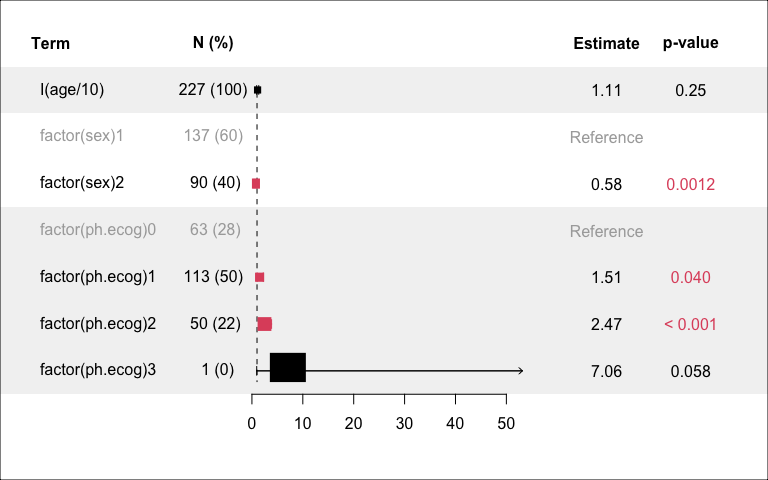
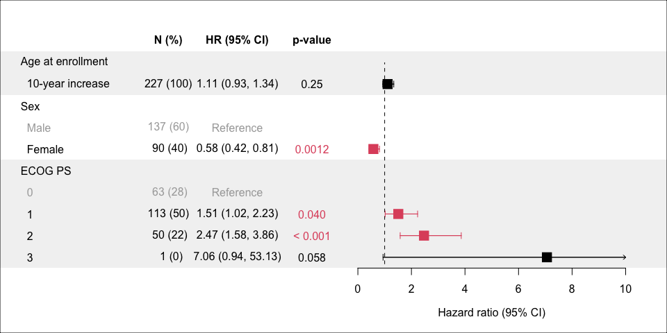

<style>
img {
  max-height: 400px;
}
table {
  max-width: 500px;
}
</style>

## forest plots

this is an experimental package and not to be trusted

-----

## Installation

``` r
# install.packages('devtools')
devtools::install_github('raredd/forest')
```

## Basic usage and supported models/objects

| object               | package      |
| :------------------- | :----------- |
| <code>coxph</code>   | **survival** |
| <code>coxphf</code>  | **coxphf**   |
| <code>crr</code>     | **cmprsk**   |
| <code>crr2</code>    | **cmprsk2**  |
| <code>formula</code> | **stats**    |
| <code>glm</code>     | **stats**    |
| <code>logistf</code> | **logistf**  |

``` r
library('survival')
forest(coxph(Surv(time, status) ~ I(age / 10) + factor(sex) + factor(ph.ecog), lung))
box('outer')
```



## More options

``` r
lung2 <- within(lung, {
  sex <- factor(sex, 1:2, c('Male', 'Female'))
  ph.ecog <- factor(ph.ecog)
})

lbl <- c('10-year increase', levels(lung2$sex), levels(lung2$ph.ecog))
forest(
  coxph(Surv(time, status) ~ I(age / 10) + sex + ph.ecog, lung2),
  header = c('Age at enrollment', 'Sex', 'ECOG PS'),
  plotArgs = list(
    cex = 2, layout = 'unified', show_conf = TRUE, xlim = c(0, 10),
    labels = lbl, reset_par = FALSE, names = c('', 'N (%)', 'HR (95% CI)', 'p-value')
  )
)
title(xlab = 'Hazard ratio (95% CI)')
box('outer')
```



## Multiple models

``` r
models <- list(
  'Model 1' = coxph(Surv(time, status) ~ age + sex + ph.ecog, lung2),
  'Model 2' = coxph(Surv(time, status) ~ age + sex, lung2),
  'Model 3' = coxph(Surv(time, status) ~ age, lung2)
)

prep_lists <- lapply(models, forest, plot = FALSE)
prep_lists <- lapply(prep_lists, function(x)
  `class<-`(x[[1L]], 'cleanfp_list'))
x <- Reduce(merge_forest, prep_lists)

group.col <- rep_len(c('grey95', 'none'), length(models))
group.col <- rep(group.col, sapply(prep_lists, function(x) length(x$Term)))

palette(c('grey70', 'green4'))
plot(
  x, col.rows = group.col, reset_par = FALSE, cex = 2,
  panel_size = c(2, 3, 2), xlim = c(0, 10)
)
palette('default')
rl <- rev(rle(group.col)$lengths)
text(
  grconvertX(0.025, 'ndc'), rev(cumsum(head(c(0, rl), -1)) + rl / 2) + 0.5,
  names(models), xpd = NA, srt = 90, adj = 0.5
)
box('outer')
```


## Panel options

``` r
x <- forest(
  coxph(Surv(time, status) ~ I(age / 10) + sex + ph.ecog, lung2),
  plot = FALSE
)
y <- replicate(7, rnorm(20), simplify = FALSE)

plot(
  x, cex = 2, panel_size = c(4, 3, 2), xlim = c(-5, 5),
  left_panel = list(
    'Mean y' = sapply(y, function(yy) sprintf('%.3f', mean(yy))),
    'Median y' = sapply(y, function(yy) sprintf('%.3f', median(yy)))
  ),
  center_panel = {
    panel_box(y)
    axis(1, pos = 0.5)
  }
)
box('outer')
```


``` r
library('rawr') ## for tplot
hr_ci <- x$cleanfp_list$numeric[1:3]
plot(
  x, xlim = c(0, 10), reset_par = FALSE,
  center_panel = {
    panel_tplot(
      rev(asplit(hr_ci, 1)), type = 'd', cex = 3,
      pch = c(16, 1, 1), group.pch = FALSE,
      col = c(1, 2, 2), group.col = FALSE
    )
    axis(1, pos = 0.5)
  }
)
legend(
  6, 8.5, legend = c('Point estimate', '95% CI'),
  col = 1:2, pch = c(16, 1), bty = 'n', xpd = NA
)
box('outer')
```


## Session info

``` r
within.list(sessionInfo(), loaded <- NULL)
```

    ## R version 4.0.2 (2020-06-22)
    ## Platform: x86_64-apple-darwin17.0 (64-bit)
    ## Running under: macOS Mojave 10.14.6
    ## 
    ## Matrix products: default
    ## BLAS:   /Library/Frameworks/R.framework/Versions/4.0/Resources/lib/libRblas.dylib
    ## LAPACK: /Library/Frameworks/R.framework/Versions/4.0/Resources/lib/libRlapack.dylib
    ## 
    ## locale:
    ## [1] en_US.UTF-8/en_US.UTF-8/en_US.UTF-8/C/en_US.UTF-8/en_US.UTF-8
    ## 
    ## attached base packages:
    ## [1] stats     graphics  grDevices utils     datasets  methods   base     
    ## 
    ## other attached packages:
    ## [1] rawr_0.9.2        survival_3.2-7    knitr_1.31        forest_0.0.0.9000
    ## 
    ## loaded via a namespace (and not attached):
    ##  [1] lattice_0.20-41   digest_0.6.27     grid_4.0.2        magrittr_2.0.1   
    ##  [5] evaluate_0.14     highr_0.8         rlang_0.4.10      stringi_1.5.3    
    ##  [9] Matrix_1.3-2      rmarkdown_2.6     splines_4.0.2     tools_4.0.2      
    ## [13] stringr_1.4.0     xfun_0.20         yaml_2.2.1        compiler_4.0.2   
    ## [17] htmltools_0.5.1.1
