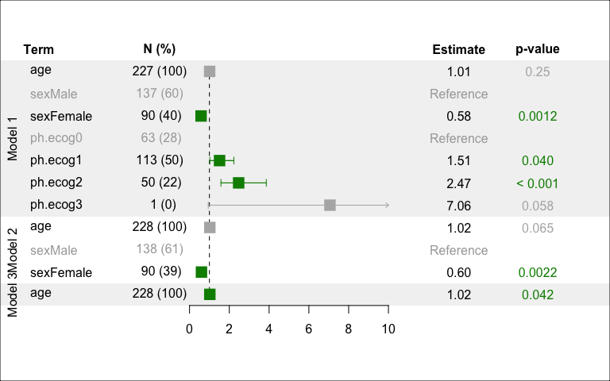

<style>
img {
  max-height: 400px;
}
table {
  max-width: 500px;
}
</style>

## forest plots

this is an experimental package and not to be trusted

------------------------------------------------------------------------

## Installation

``` r
# install.packages('devtools')
devtools::install_github('raredd/forest')
```

## Basic usage and supported models/objects

| object               | package                                                          |
|:---------------------|:-----------------------------------------------------------------|
| <code>coxph</code>   | **[survival](https://cran.r-project.org/web/packages/survival)** |
| <code>coxphf</code>  | **[coxphf](https://cran.r-project.org/web/packages/coxphf)**     |
| <code>crr</code>     | **[cmprsk](https://cran.r-project.org/web/packages/cmprsk)**     |
| <code>crr2</code>    | **[cmprsk2](https://github.com/raredd/cmprsk2)**                 |
| <code>formula</code> | **stats**                                                        |
| <code>glm</code>     | **stats**                                                        |
| <code>logistf</code> | **[logistf](https://cran.r-project.org/web/packages/logistf)**   |

``` r
library('survival')
forest(coxph(Surv(time, status) ~ I(age / 10) + factor(sex) + factor(ph.ecog), lung))
box('outer')
```


## More options

``` r
lung2 <- within(lung, {
  sex <- factor(sex, 1:2, c('Male', 'Female'))
  ph.ecog <- factor(ph.ecog)
})

lbl <- c('10-year increase', levels(lung2$sex), levels(lung2$ph.ecog))
forest(
  coxph(Surv(time, status) ~ I(age / 10) + sex + ph.ecog, lung2),
  header = c('Age at enrollment', 'Sex', 'ECOG PS'),
  plotArgs = list(
    cex = 2, layout = 'unified', show_conf = TRUE, xlim = c(0, 10),
    labels = lbl, reset_par = FALSE, names = c('', 'N (%)', 'HR (95% CI)', 'p-value')
  )
)
title(xlab = 'Hazard ratio (95% CI)')
box('outer')
```


## Multiple models

``` r
models <- list(
  'Model 1' = coxph(Surv(time, status) ~ age + sex + ph.ecog, lung2),
  'Model 2' = coxph(Surv(time, status) ~ age + sex, lung2),
  'Model 3' = coxph(Surv(time, status) ~ age, lung2)
)

forest2(
  models, cex = 2, col.sig = c('grey70', 'green4'),
  panel_size = c(2, 3, 2), xlim = c(0, 10)
)
box('outer')
```



## Panel options

``` r
set.seed(1)
x <- forest(
  coxph(Surv(time, status) ~ I(age / 10) + sex + ph.ecog, lung2),
  plot = FALSE
)
y <- replicate(7, rnorm(20), simplify = FALSE)

plot(
  x, cex = 2, panel_size = c(4, 3, 2), xlim = c(-5, 5),
  left_panel = list(
    'Mean y' = sapply(y, function(yy) sprintf('%.3f', mean(yy))),
    'Median y' = sapply(y, function(yy) sprintf('%.3f', median(yy)))
  ),
  center_panel = {
    panel_box(y)
    axis(1, pos = 0.5)
  }
)
box('outer')
```


``` r
library('rawr') ## for tplot
hr_ci <- x$cleanfp_list$numeric[1:3]
plot(
  x, xlim = c(0, 10), reset_par = FALSE,
  center_panel = {
    panel_tplot(
      rev(asplit(hr_ci, 1)), type = 'd', cex = 3,
      pch = c(16, 1, 1), group.pch = FALSE,
      col = c(1, 2, 2), group.col = FALSE
    )
    axis(1, pos = 0.5)
  }
)
legend(
  6, 8.5, legend = c('Point estimate', '95% CI'),
  col = 1:2, pch = c(16, 1), bty = 'n', xpd = NA
)
box('outer')
```


## Coerce raw data to a forest plot

``` r
set.seed(1)
x <- c(NA, 1, 2, NA, 1, 2, 3)
dat <- data.frame(
  N = x * 10,
  x = x,
  lower = x - 1,
  upper = x + 1,
  p.value = replace(runif(7), is.na(x), NA)
)
dat
```

    ##    N  x lower upper   p.value
    ## 1 NA NA    NA    NA        NA
    ## 2 10  1     0     2 0.3721239
    ## 3 20  2     1     3 0.5728534
    ## 4 NA NA    NA    NA        NA
    ## 5 10  1     0     2 0.2016819
    ## 6 20  2     1     3 0.8983897
    ## 7 30  3     2     4 0.9446753

``` r
x <- as.forest(
  x = dat$x, lower = dat$lower, upper = dat$upper, p.value = dat$p.value,
  labels = ifelse(is.na(dat$x), 'header', paste0('   ', x)),
  N = dat$N, P = dat$N / 100
)
x
```

    ##      Term     N (%)     Estimate CI            p-value
    ## [1,] "header" ""        ""       ""            ""     
    ## [2,] " 1"     "10 (10)" "1.00"   "0.00 - 2.00" "0.37" 
    ## [3,] " 2"     "20 (20)" "2.00"   "1.00 - 3.00" "0.57" 
    ## [4,] "header" ""        ""       ""            ""     
    ## [5,] " 1"     "10 (10)" "1.00"   "0.00 - 2.00" "0.20" 
    ## [6,] " 2"     "20 (20)" "2.00"   "1.00 - 3.00" "0.90" 
    ## [7,] " 3"     "30 (30)" "3.00"   "2.00 - 4.00" "0.94"

``` r
plot(x, show_conf = TRUE)
box('outer')
```


## Session info

``` r
within.list(sessionInfo(), loadedOnly <- NULL)
```

    ## R version 4.1.2 (2021-11-01)
    ## Platform: x86_64-apple-darwin17.0 (64-bit)
    ## Running under: macOS Big Sur 10.16
    ## 
    ## Matrix products: default
    ## BLAS:   /Library/Frameworks/R.framework/Versions/4.1/Resources/lib/libRblas.0.dylib
    ## LAPACK: /Library/Frameworks/R.framework/Versions/4.1/Resources/lib/libRlapack.dylib
    ## 
    ## locale:
    ## [1] en_US.UTF-8/en_US.UTF-8/en_US.UTF-8/C/en_US.UTF-8/en_US.UTF-8
    ## 
    ## attached base packages:
    ## [1] stats     graphics  grDevices utils     datasets  methods   base     
    ## 
    ## other attached packages:
    ## [1] rawr_1.0.1        survival_3.3-2    knitr_1.38        forest_0.0.0.9000
